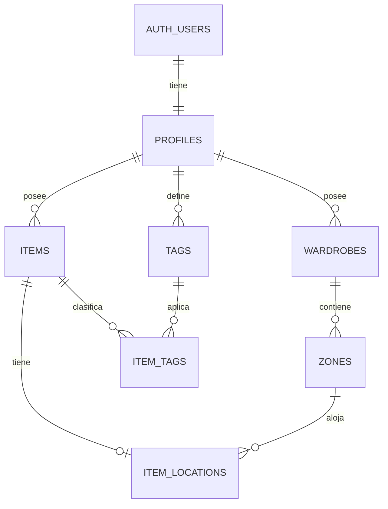

# ADR-0002 · Modelo de datos inicial

## Estado de la decisión

Aceptada por el usuario el 2026-09-18. Este modelo pasa a ser la referencia para
las futuras migraciones y cambios de Supabase, que se implementarán en una tarea
específica cuando se solicite.

## Contexto

El MVP definido en [[Producto]] necesita:

- una cuenta propietaria de todos los datos;
- una plantilla inicial con un armario y dos zonas;
- varios armarios compuestos por zonas rectangulares;
- artículos activos o archivados, con una imagen principal y etiquetas;
- como máximo una ubicación actual por artículo;
- artículos sin asignar cuando no existe una ubicación;
- eliminación de armarios o zonas sin eliminar los artículos;
- aislamiento estricto entre usuarios mediante RLS.

## Propuesta

Usar un modelo relacional normalizado. La geometría visual se guarda como datos
estructurados y la ubicación actual vive separada del artículo. No se guarda el
canvas completo como JSON.

### `profiles`

Extensión mínima de `auth.users` para información visible y estado de
inicialización.

- `id uuid` — PK y FK a `auth.users.id`, con borrado en cascada.
- `display_name text`.
- `avatar_url text`.
- `initialized_at timestamptz` — permite saber si ya se creó la plantilla
  inicial y evita recrearla si el usuario borra todos sus armarios.
- `created_at timestamptz`, `updated_at timestamptz`.

El correo y la identidad OAuth permanecen en Supabase Auth. Los metadatos del
usuario solo se usan para presentación; nunca para autorización.

### `wardrobes`

Representa cada armario dibujado en el canvas principal.

- `id bigint identity` — PK.
- `user_id uuid` — propietario.
- `name text` — obligatorio.
- `room text`, `description text` — opcionales.
- `position_x numeric`, `position_y numeric`, `width numeric`, `height numeric`
  — geometría en unidades lógicas independientes de píxeles.
- `z_index integer` — orden de superposición.
- `created_at timestamptz`, `updated_at timestamptz`.

Se añade `unique (id, user_id)` para que las tablas hijas puedan garantizar por
FK que pertenecen al mismo usuario.

### `zones`

Representa una zona rectangular dentro de un armario.

- `id bigint identity` — PK.
- `user_id uuid` — propietario, duplicado deliberadamente para RLS eficiente e
  integridad entre relaciones.
- `wardrobe_id bigint` — armario padre.
- `name text` — obligatorio.
- `type text` — sección, balda, cajón, barra, caja u otro.
- `color text` — token o color visual.
- `position_x numeric`, `position_y numeric`, `width numeric`, `height numeric`
  — geometría relativa al armario.
- `z_index integer`.
- `created_at timestamptz`, `updated_at timestamptz`.

Una FK compuesta `(wardrobe_id, user_id)` apunta a `wardrobes (id, user_id)`.
Al eliminar el armario, sus zonas se eliminan en cascada.

### `items`

Ficha del artículo, independiente de su ubicación.

- `id bigint identity` — PK.
- `user_id uuid` — propietario.
- `name text`, `image_path text`, `category text` — obligatorios.
- `description text`, `primary_color text`, `brand text`, `size_label text`,
  `material text` — opcionales.
- `seasons text[]` — selección entre primavera, verano, otoño e invierno.
- `status text` — `active` o `archived`.
- `archived_at timestamptz` — nulo mientras está activo.
- `created_at timestamptz`, `updated_at timestamptz`.

La categoría y el estado usan texto con restricciones `check`, evitando enums
de PostgreSQL difíciles de modificar. Se añade `unique (id, user_id)`.

### `item_locations`

Mantiene únicamente la ubicación actual. La ausencia de fila significa «Sin
asignar».

- `item_id bigint` — PK; garantiza como máximo una ubicación por artículo.
- `zone_id bigint`.
- `user_id uuid` — propietario para RLS y validación de pertenencia.
- `updated_at timestamptz`.

Las FK compuestas `(item_id, user_id)` y `(zone_id, user_id)` impiden asignar un
artículo a una zona de otro usuario. Eliminar una zona elimina en cascada solo la
fila de ubicación: el artículo permanece y pasa a estar sin asignar.

No se guardan coordenadas del artículo dentro de la zona porque las miniaturas
se distribuyen automáticamente en una cuadrícula.

### `tags` e `item_tags`

Las etiquetas son reutilizables y privadas para cada usuario.

- `tags`: `id`, `user_id`, `name`, fechas; el nombre es único por usuario sin
  distinguir mayúsculas y minúsculas.
- `item_tags`: `user_id`, `item_id`, `tag_id`; PK compuesta y FK compuestas para
  impedir relaciones entre propietarios distintos.

## Plantilla del primer acceso

Después de autenticar, la aplicación llama una operación idempotente
`initialize_user_workspace()` ejecutada con los permisos del usuario. En una
transacción:

1. crea o completa `profiles`;
2. comprueba `initialized_at`;
3. crea un armario y dos zonas predeterminadas;
4. marca la inicialización como completada.

La operación no recibe un `user_id` del cliente: utiliza `(select auth.uid())`.
Debe ser segura ante llamadas simultáneas y no vuelve a crear la plantilla si el
usuario elimina después todos sus armarios.

## Imágenes

Se usa un bucket privado de Storage. Cada objeto se guarda bajo un prefijo del
propietario, por ejemplo `<user_id>/<object_id>.<ext>`, y `items.image_path`
conserva únicamente la ruta. Las políticas de Storage validan el primer segmento
contra `(select auth.uid())`.

Eliminar permanentemente un artículo requiere una operación que elimine tanto
la fila como el objeto de Storage. El borrado de una fila no elimina por sí solo
el archivo.

## Archivado y borrado

- Archivar actualiza `items.status`, establece `archived_at` y elimina su fila
  de `item_locations` dentro de una sola transacción.
- Restaurar establece el estado activo y mantiene el artículo sin ubicación.
- El borrado permanente elimina artículo, ubicación y relaciones de etiquetas
  por cascada; el archivo se elimina explícitamente de Storage.
- Eliminar una zona o un armario elimina su estructura y sus ubicaciones, pero
  nunca los artículos.

## RLS y privilegios

- RLS se habilita en todas las tablas expuestas.
- Las políticas comparan `user_id` con `(select auth.uid())` y se aplican al rol
  `authenticated`.
- Todas las columnas usadas por RLS y todas las FK se indexan.
- No se usa `raw_user_meta_data` para autorizar.
- El cliente recibe solo los privilegios necesarios; ninguna clave
  `service_role` se expone en Angular.
- Las políticas de inserción y actualización incluyen `with check` además de
  `using`.

## Índices iniciales

- Índices en `user_id` para armarios, zonas, artículos y etiquetas.
- Índices en `zones.wardrobe_id`, `item_locations.zone_id` y todas las demás FK.
- Índice parcial de artículos activos por usuario y fecha de modificación para
  la pantalla habitual del inventario.
- Índice único por `user_id` y `lower(tags.name)`.

No se añade búsqueda de texto avanzada en el MVP. Se medirá el uso antes de
incorporar `pg_trgm` o búsqueda de texto completo.

## Alternativas consideradas

- Guardar todo el canvas como JSON — descartado porque dificulta las relaciones,
  la validación de propiedad, las consultas y los cambios parciales.
- Guardar `zone_id` directamente en `items` — más simple, pero la tabla separada
  expresa mejor la ausencia de ubicación, permite eliminar una zona sin tocar la
  ficha y garantiza la pertenencia mediante FK compuestas.
- Crear una tabla de imágenes — descartado por ahora porque el MVP admite una
  única imagen principal. Se añadirá si se decide soportar galerías.
- Guardar historial de ubicaciones — descartado porque la experiencia solo exige
  la ubicación actual.

## Consecuencias

- Positivas: reglas del producto expresadas en restricciones de base de datos,
  aislamiento multiusuario eficiente y eliminación segura de zonas.
- Negativas / compromisos: algunas operaciones requieren transacciones y hay
  relaciones adicionales para ubicación y etiquetas.
- Evolución prevista: galerías, historial de ubicación o conjuntos de ropa
  requerirán tablas nuevas, sin obligar a rediseñar las actuales.

## Tareas relacionadas

- [[Tareas/Completar plantillas de la bóveda de memoria]]

## Decisiones relacionadas

- [[Decisiones/ADR-0004 Aislamiento de Outify en Supabase compartido]]
